# Personal Website Hasil Generate AI #

## Prompt ##

Tolong buatkan satu halaman static html untuk website pribadi. Jangan gunakan bahasa pemrograman ataupun database.

Isi website adalah :
- Informasi kontak
- Kompetensi
- Portofolio

Konten website bisa diambil dari Linked In, Github, dan Youtube. Silakan buatkan summary dari konten tersebut.

- Linked In : endymuhardin
- Github : endymuhardin
- Youtube : artivisi
- Personal Website : software.endy.muhardin.com

CSS bisa menggunakan framework CSS yang ada di internet, seperti Bootstrap, Tailwind, Bulma, dll. Silakan pilih salah satu yang paling ringan dan sederhana supaya tidak memberatkan loading website.
Website ini bisa diakses di semua device, baik desktop maupun mobile. Buatkan responsive design yang estetik, modern dengan warna yang ceria dan energik. Gunakan font yang modern dan mudah dibaca.

Sertakan juga link ke akun Linked In, Github, dan Youtube tersebut dengan menggunakan icon yang sesuai.

## Hasil Generate ##

* [Hasil Gemini](./index-gemini.html)
* [Hasil ChatGPT](./index-chatgpt.html)
* [Hasil Roo Code menggunakan Gemini 2.5 Flash](./index-roo.html)

## Gemini via Web ##

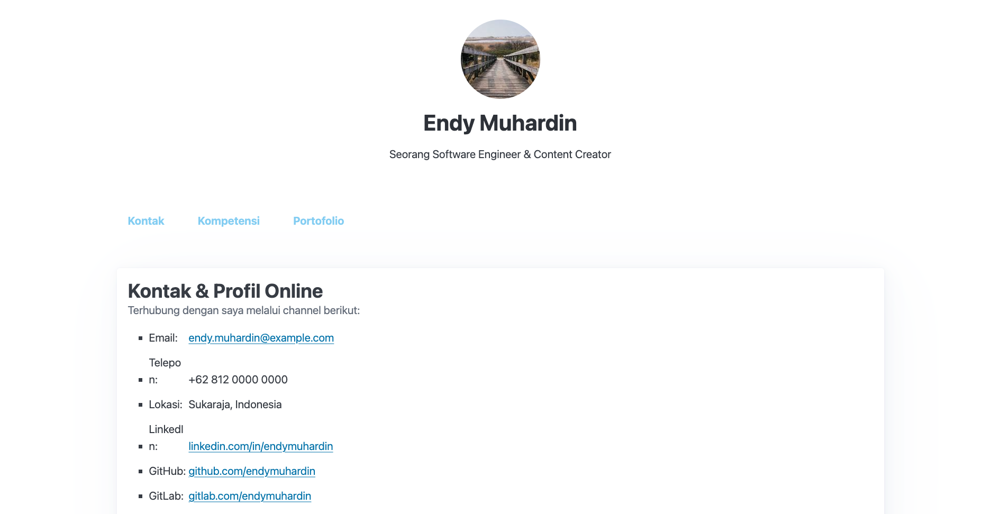

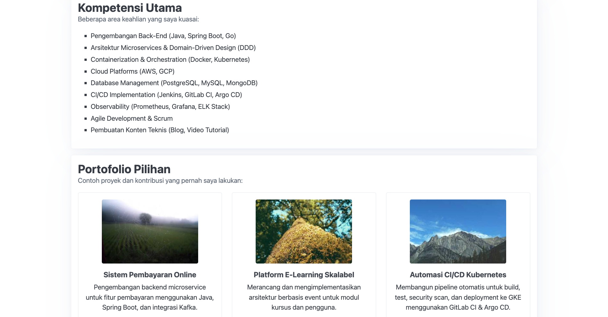

## ChatGPT via Web ##

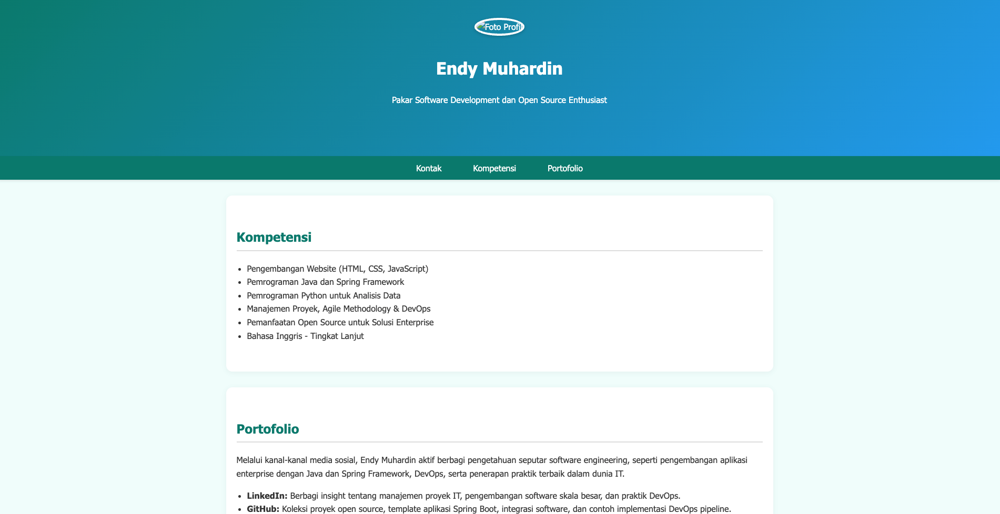

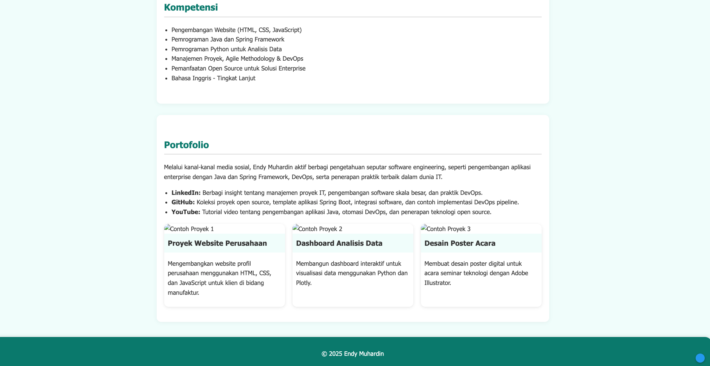

## Roo Code dengan Gemini 2.5 Flash ##

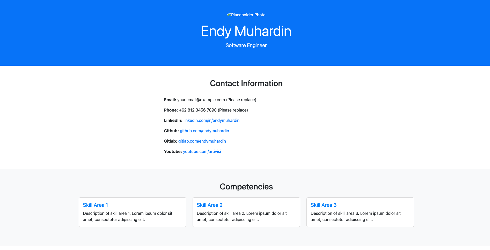

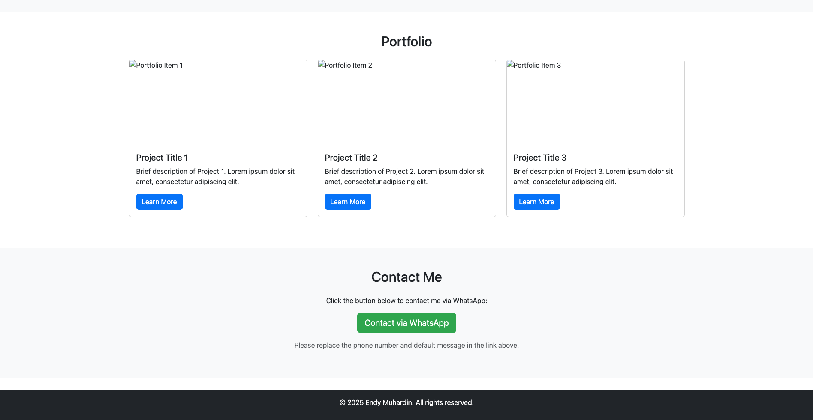

## Claude 3.7 Sonnet ##

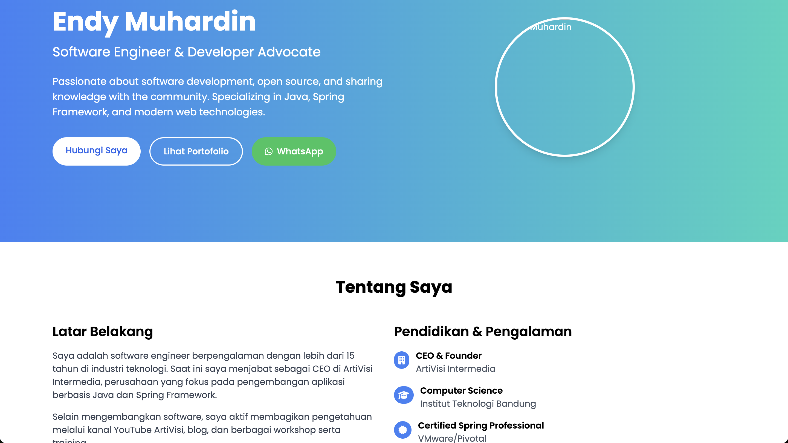

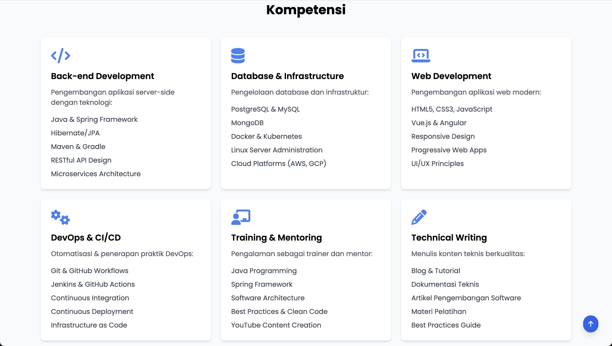

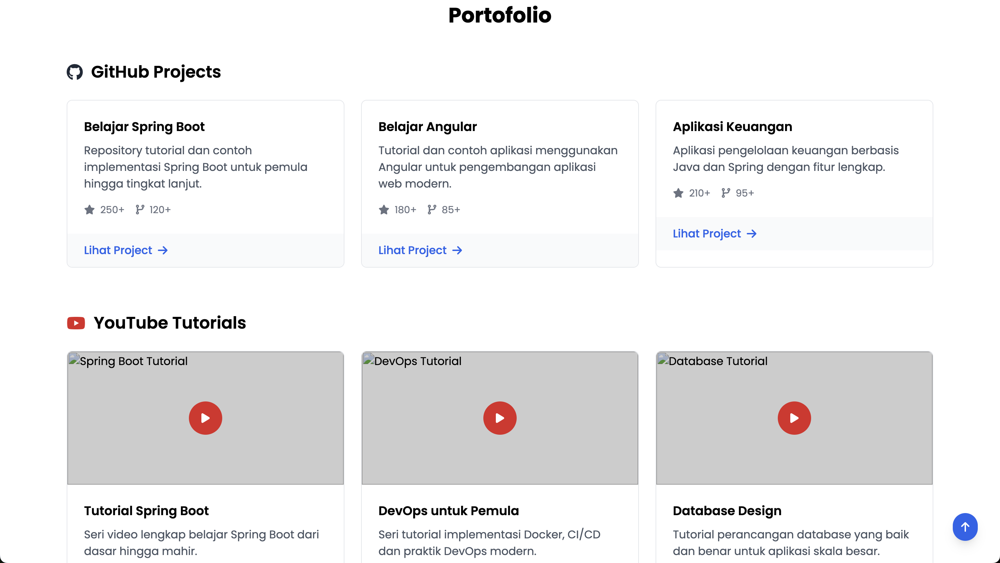

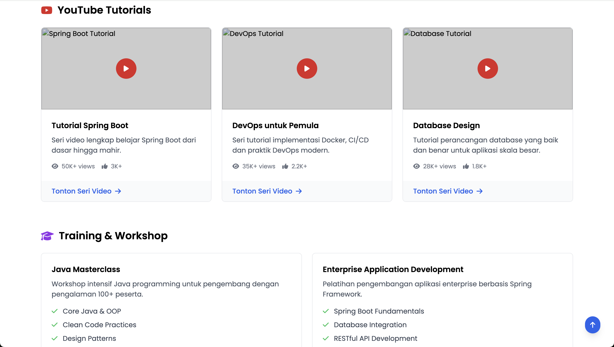

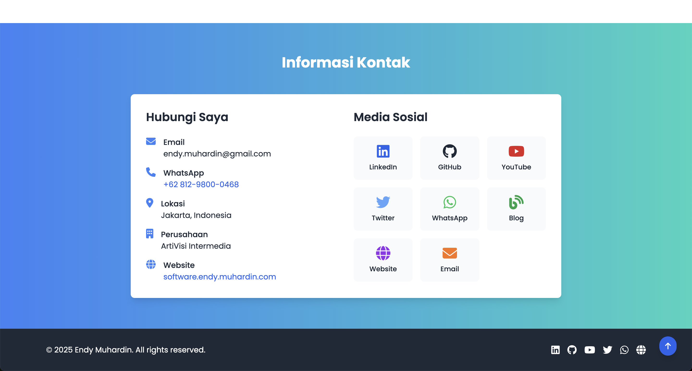

# Catatan #

* Hasil Claude 3.7 Sonnet paling oke, jauh melebihi AI yang lain. Codingnya komplit, visualnya bagus. Tapi ada beberapa konten yang halu. Padahal sudah diberikan sumber yang jelas.
* Hasil generate ChatGPT dan Gemini lebih komplit daripada Roo Code secara struktur. Sudah ada link menu, dan hasil visualnya lebih baik.
* Gemini bisa membaca konten dari Linked In, Github, dan Youtube, membuat summary, dan menampilkannya di halaman web.
* Image placeholder yang dipasang ChatGPT tidak ada aslinya (404)
* Roo Code tidak mau disuruh membaca konten dari Linked In, Github, dan Youtube. Dia mengajukan alasan privasi.

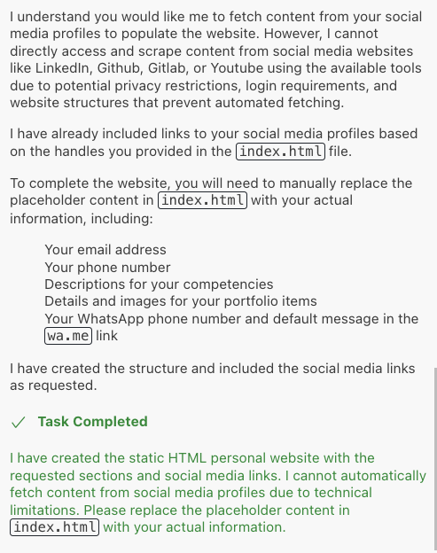